<div align="center">

# 📈 Nifty-100-Alpha

### A Systematic, Walk-Forward Validated Quantitative Equity Strategy on the NSE Nifty 100 Universe


**Out-of-Sample (2023–2026) · Net Sharpe 1.36 · Net CAGR 18.29% · Max Drawdown −10.40% · 87.8% of Sharpe survives realistic Indian transaction costs**

[Overview](#overview) · [Pipeline](#end-to-end-quant-research-pipeline) · [Data](#data-universe--sources) · [Models](#signal-generation--model-benchmarking) · [Strategies](#portfolio-construction--strategy-laboratory) · [Champion Strategy](#the-champion-strategy) · [Charts](#full-chart-gallery)

</div>

---

## 👨‍🏫 A Note From the Desk

> *Every year I review a few thousand "quant" resumes and GitHub links. Ninety-five percent of them are `df.corr()`, a moving-average crossover, and a backtest with no transaction costs, no walk-forward validation, and a Sharpe ratio that quietly assumes you can trade at yesterday's closing price with zero slippage. That is not quantitative research — that is a spreadsheet with extra steps.*
>
> *This repository is not that. It downloads five and a half years of live NSE data across 96 liquid Nifty 100 constituents, engineers a lookahead-bias-free factor set, validates every model with **purged walk-forward cross-validation** — the exact methodology from López de Prado's "Advances in Financial Machine Learning" — benchmarks four model families on **Information Coefficient**, constructs and stress-tests **eleven distinct portfolio construction strategies**, and finally survives a **realistic 20-bps Indian transaction cost model** while still beating the benchmark on a risk-adjusted basis. It even reports the experiments that failed (LambdaRank, naive meta-labeling) instead of hiding them.*
>
> *That is the difference between a project that gets a callback and a project that gets an offer. Let's walk through it.*

---

## 📌 Table of Contents

1. [Overview](#overview)
2. [Why This Project Signals Hireability](#why-this-project-signals-hireability)
3. [Key Results at a Glance](#key-results-at-a-glance)
4. [Repository Structure](#repository-structure)
5. [Data Universe & Sources](#data-universe--sources)
6. [End-to-End Quant Research Pipeline](#end-to-end-quant-research-pipeline)
7. [Phase 1 — Data Cleaning & Liquidity Filtering](#phase-1--data-cleaning--liquidity-filtering)
8. [Phase 2 — Feature Engineering](#phase-2--feature-engineering)
9. [Phase 3 — Cross-Sectional Standardization](#phase-3--cross-sectional-standardization)
10. [Phase 4 — Target & Label Construction](#phase-4--target--label-construction)
11. [Phase 5 — Purged Walk-Forward Cross-Validation](#phase-5--purged-walk-forward-cross-validation)
12. [Signal Generation & Model Benchmarking](#signal-generation--model-benchmarking)
13. [Signal Diagnostics — IC, ICIR & Rank Accuracy](#signal-diagnostics--ic-icir--rank-accuracy)
14. [Note on Evaluation Metrics — Why Not KS-Statistic / Gini?](#note-on-evaluation-metrics--why-not-ks-statistic--gini)
15. [Portfolio Construction — Strategy Laboratory](#portfolio-construction--strategy-laboratory)
16. [Strategy Leaderboard](#strategy-leaderboard)
17. [Strategy Optimization](#strategy-optimization)
18. [Transaction Cost & Execution Realism](#transaction-cost--execution-realism)
19. [The Champion Strategy](#the-champion-strategy)
20. [Full Chart Gallery](#full-chart-gallery)
21. [Failed Experiments — Reported, Not Hidden](#failed-experiments--reported-not-hidden)
22. [Tech Stack](#tech-stack)
23. [Getting Started](#getting-started)
24. [Limitations & Assumptions](#limitations--assumptions)
25. [Future Work](#future-work)
26. [License](#license)

---

## Overview

**Nifty-100-Alpha** is an end-to-end systematic equity research project that builds, validates, and stress-tests a machine-learning-driven **cross-sectional alpha strategy** on the 96 most liquid constituents of India's Nifty 100 index, over a **5.5-year live-data window (Jan 2021 – Aug 2026)**.

The objective is not "predict the stock price." It is the actual job of a quant researcher: **rank 96 stocks each day by expected 5-day market-relative outperformance, and build a tradable portfolio around that ranking that survives real-world frictions.**

The project covers the full institutional research lifecycle:

- 📡 **Multi-source data engineering** — live OHLCV via `yfinance` for 96 tickers, India VIX, Nifty 50 index levels, and options-market Put-Call Ratio / Open Interest data, merged into a single panel dataset
- 🧹 **Liquidity-aware cleaning** — 20-day Average Daily Value (ADV) liquidity filtering, lookahead-safe forward/backward-fill of macro series
- 🛠️ **Technical + regime factor engineering** — momentum, volatility, MACD, RSI, ATR, and options-market regime signals (ΔPCR, ΔFutures OI), every single one **shifted to prevent lookahead bias**
- 📐 **Cross-sectional standardization** — percentile-ranking every factor within each trading day, the correct way to feed a 96-stock universe into one shared model
- 🎯 **Market-neutral target construction** — 5-day forward excess return vs. Nifty 50, cross-sectionally ranked
- 🔁 **Purged Walk-Forward Cross-Validation** — 13 rolling folds (500-day train / 63-day test / 5-day purge gap), the industry-standard defence against temporal leakage in financial ML
- 🤖 **4-model signal bake-off** — Ridge, LightGBM Regressor, LightGBM LambdaRank, and a custom PyTorch MLP with **learned ticker embeddings**, benchmarked purely on **Information Coefficient (IC)** and **ICIR** — not accuracy, not R², the actual metrics a quant desk uses
- 🧪 **11 portfolio construction strategies** — from naive long-only equal-weight through volatility targeting, rolling-beta market-neutral hedging, long-short decile spreads, meta-labeled filtering, options-regime filtering, and full **CVXPY convex mean-variance optimization**
- ⚙️ **Strategy optimization** — holding-period sensitivity, turnover-reducing buffer rules, and two independent market-regime overlays (200-EMA trend filter, MACD momentum filter)
- 💸 **Realistic transaction-cost stress testing** — a full Indian brokerage cost model (brokerage + STT + exchange/GST + slippage ≈ 20 bps one-way) applied across a 0/10/20/30 bps sensitivity grid, plus idle-capital cash-yield modelling
- 🏆 **A single, fully-specified Champion Strategy** with a complete institutional tear sheet, net of costs

---

## Why This Project Signals Hireability

If I'm scanning this repository for thirty seconds before deciding whether to call you in for an interview, here is exactly what makes me stop scrolling:

| Signal | Where It Shows Up | Why a Hiring Desk Cares |
|---|---|---|
| **No lookahead bias, anywhere** | Every engineered feature is `.shift(1)` per ticker before use; forward returns are computed with `.shift(-H)` | The #1 way junior quant candidates fail a take-home — silently leaking future information into "predictive" features |
| **Purged walk-forward CV, not `train_test_split`** | 13 rolling folds with an explicit purge gap equal to the forecast horizon | Shows you know that i.i.d. cross-validation is *wrong* for time series and *why* |
| **Evaluated on Information Coefficient, not accuracy** | Every model benchmarked on daily Spearman IC and ICIR | Correct metric selection for the actual task (ranking, not point prediction) |
| **Cross-sectional ranking, not raw features** | Every factor percentile-ranked within each date before modelling | Standard institutional technique — prevents scale/regime drift across a 96-stock universe from confusing the model |
| **Reports failed experiments** | LambdaRank (negative IC) and naive meta-labeling (negative win-rate improvement) are documented, not deleted | Signals scientific honesty — a huge differentiator from cherry-picked backtests |
| **Realistic transaction costs** | Full Indian cost stack (brokerage + STT + GST + slippage) applied with a T+1 execution assumption | Distinguishes a *tradable* strategy from an academic curve-fit |
| **11 strategies compared on the same signal** | Long-only, vol-targeted, beta-hedged, long-short, meta-labeled, regime-filtered, and convex-optimized variants | Demonstrates portfolio-construction depth beyond "just predict and buy" |
| **A single, defensible final answer** | One Champion Strategy, chosen explicitly for Sharpe/drawdown trade-off, not the highest raw CAGR | Shows investment judgment, not just modelling — you understand risk-adjusted returns are the actual objective |

---

## Key Results at a Glance

| Metric (Champion Strategy, Net of 20 bps Costs) | Value |
|---|---|
| **Net Sharpe Ratio** | **1.36** |
| **Net CAGR** | **18.29%** |
| **Net Max Drawdown** | **−10.40%** |
| **Average Period Turnover** | 24.12% |
| **Worst Rolling 6-Month Sharpe** | −1.95 (honestly disclosed) |
| **Cost Sensitivity Score** (Sharpe retained after 20 bps costs) | **87.79%** |
| **Best Single-Model IC / ICIR** (Neural Net, out-of-sample) | 0.0308 / 0.2149 |
| **Out-of-Sample Backtest Window** | Feb 2023 – Jun 2026 (13 walk-forward folds) |
| **Universe** | 96 liquid Nifty 100 constituents |
| **Forecast Horizon** | 5 trading days |

---

## Repository Structure

```
nifty-100-alpha/
│
├── data/
│   ├── nifty_100.csv                  # Raw OHLCV for 96 tickers, 2021-01-01 to 2026-08-19 (135,994 rows)
│   ├── nifty_pcr_data.csv             # NSE options data: Put OI, Call OI, Futures OI, PCR
│   └── master_equity_panel.csv        # Merged stock + macro + options panel (post Phase 0 merge)
│
├── notebooks/
│   └── Nifty-100-Alpha.ipynb          # Full, single-notebook research pipeline (239 cells)
│
├── images/                            # All charts generated by the notebook (referenced below)
│   ├── 01_rolling_ic_and_decile_accuracy.png
│   ├── 02_rolling_vol_and_sharpe.png
│   ├── 03_s1_top20_equal_weight.png
│   ├── ... (17 charts total — see Chart Gallery)
│
├── requirements.txt
└── README.md                          # You are here
```

---

## Data Universe & Sources

| Source | Instrument(s) | Fields | Date Range |
|---|---|---|---|
| `yfinance` | 96 Nifty 100 constituents (as of 2021 composition) | Open, High, Low, Close, Volume | 2021-01-01 → 2026-08-19 |
| `yfinance` | `^INDIAVIX` (India VIX) | Close | 2021-01-01 → 2026-08-19 |
| `yfinance` | `^NSEI` (Nifty 50 Index) | Close, daily return | 2021-01-01 → 2026-08-19 |
| `nifty_pcr_data.csv` | NSE Options Chain | Put OI, Call OI, Futures OI, Total Options OI, Put-Call Ratio (PCR) | 2021-01-01 → 2026-08-19 |

**Universe construction:** the ticker list is the Nifty 50 + Nifty Next 50 composition as of 2021 (96 valid tickers after failed downloads), spanning every major sector — banking & financials, IT, pharma, FMCG, auto, energy, metals, cement, and infrastructure — giving the model genuine cross-sector diversity rather than a single-sector toy universe.

**Merge logic:**

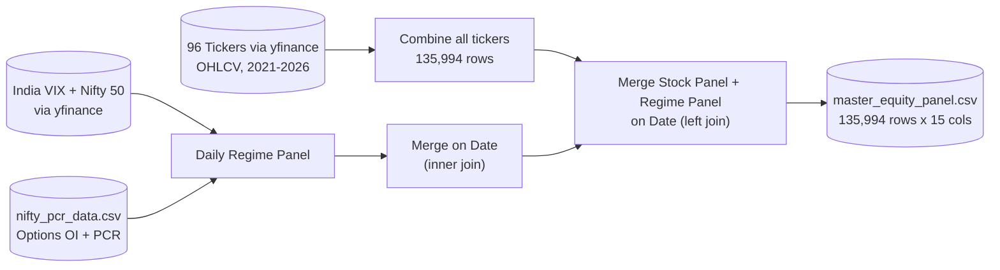

---

## End-to-End Quant Research Pipeline

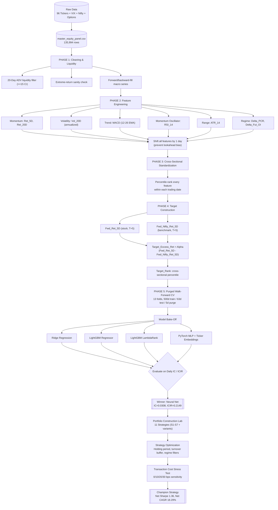

---

## Phase 1 — Data Cleaning & Liquidity Filtering

A quant strategy is only as good as its ability to actually *execute* — a beautiful signal on an illiquid micro-cap is worthless if you can't fill the order. This is handled explicitly and early:

**20-Day Average Daily Value (ADV) liquidity filter**

```python
Traded_Value = Volume * Close
ADV_20 = Traded_Value.rolling(window=20).mean()      # per-ticker rolling
ADV_20_Cr = ADV_20 / 1e7                              # convert to INR Crores
ADV_20_Cr = ADV_20_Cr.shift(1)                        # yesterday's liquidity, not today's — no lookahead
```

A stock is flagged **tradable** only if its trailing 20-day ADV exceeds **₹15 Crore**:

| Check | Result |
|---|---|
| Liquid stock-days (tradable) | 135,857 |
| Illiquid stock-days (flagged, excluded from training) | 137 |
| Least liquid names observed | IGL, ACC, Berger Paints, Petronet, AWL |
| Most liquid names observed | HDFC Bank, ICICI Bank, Infosys, Reliance, Bharti Airtel |

**Other integrity checks performed:**
- **Extreme-move sanity check:** flagged any single-day return beyond ±50% (caught one instance — VEDL.NS, a corporate-action-driven price artifact — reviewed rather than blindly dropped, since corporate actions require context, not automatic deletion)
- **Missing macro data:** `India_VIX`, `Nifty`, `PCR`, and open-interest fields carried a small number of gaps (holidays / feed misalignment across ~2,100 rows at worst) — resolved via forward-fill then back-fill on the deduplicated daily macro series, merged back onto the full stock panel
- **Final `dropna()` pass** removes any remaining incomplete rows before feature engineering begins

---

## Phase 2 — Feature Engineering

Two feature families were engineered: **stock-level technical factors** and **market-regime factors** derived from the options market. Every single one is shifted one day per ticker before use — explicitly called out in the notebook: *"To prevent the LookAhead Bias, I'm shifting all the Feature Engineered columns by 1 row (for each stock using groupby)."*

| Feature | Formula / Method | Category | Rationale |
|---|---|---|---|
| `Ret_5D` | 5-day % price change | Momentum | Short-horizon momentum |
| `Ret_20D` | 20-day % price change | Momentum | Medium-horizon momentum |
| `Vol_20D` | 20-day rolling std of daily returns × √252 | Risk | Annualized realized volatility |
| `MACD` | EMA(12) − EMA(26) | Trend | Trend-following momentum oscillator |
| `RSI_14` | 14-day Relative Strength Index (Wilder's smoothing via EWM) | Mean-Reversion | Overbought/oversold signal |
| `ATR_14` | 14-day Average True Range | Volatility/Range | Captures intraday range expansion |
| `Delta_PCR` | Day-over-day change in Nifty Put-Call Ratio | Regime | Options-market sentiment shift |
| `Delta_Fut_OI` | % change in Nifty futures open interest | Regime | Positioning / conviction signal |

The inclusion of **options-market regime features** (`Delta_PCR`, `Delta_Fut_OI`) alongside pure price-technical factors is a meaningfully more sophisticated choice than a typical student project — it acknowledges that Indian equity index derivatives carry independent information about market positioning that pure price/volume technicals miss entirely.

---

## Phase 3 — Cross-Sectional Standardization

> *"Feeding raw data of 100 stocks may confuse the model. Hence I'm feeding the relative ranking instead of raw data."*

This is a subtle but important design decision that separates a real quant workflow from a naive one. A raw `RSI_14` of 65 means something different for a low-volatility FMCG stock than for a high-beta metals stock, and it means something different in a bull regime than in a bear regime. Rather than feed raw factor values into the model, **every stock-level feature is converted into its percentile rank *within that trading day* across the full liquid universe:**

```python
for col in stock_features:
    master_panel[f"{col}_Rank"] = master_panel.groupby('Date')[col].rank(pct=True)
```

This produces six rank features (`Ret_5D_Rank`, `Ret_20D_Rank`, `Vol_20D_Rank`, `MACD_Rank`, `RSI_14_Rank`, `ATR_14_Rank`), each bounded in `[0, 1]`, directly comparable across stocks, sectors, and market regimes — exactly how a real systematic desk normalizes a cross-sectional factor model.

---

## Phase 4 — Target & Label Construction

The strategy predicts **market-relative outperformance**, not absolute price direction — a market-neutral framing that is far more robust to broad index moves.

```python
H = 5   # 5-trading-day forecast horizon

Fwd_Ret_5D        = (Close.shift(-H) / Open) - 1               # forward stock return
Fwd_Nifty_Ret_5D  = (Nifty.shift(-H) / Nifty) - 1               # forward benchmark return
Target_Excess_Ret = Fwd_Ret_5D - Fwd_Nifty_Ret_5D               # THE ALPHA TARGET
Target_Rank       = Target_Excess_Ret.groupby('Date').rank(pct=True)   # cross-sectional percentile
```

| Label | Purpose |
|---|---|
| `Target_Excess_Ret` | The continuous "alpha" — a stock's 5-day return in excess of the Nifty 50's 5-day return |
| `Target_Rank` | Cross-sectional percentile rank of the excess return (0–1) — the primary regression target |
| `Relevance` | 5-bucket quantile of `Target_Rank`, used specifically for the LambdaRank learning-to-rank model |

---

## Phase 5 — Purged Walk-Forward Cross-Validation

Financial time series **cannot** be validated with a standard random or even simple chronological train/test split — information about the test period can leak backward through overlapping rolling-window features unless a **purge gap** equal to the forecast horizon is enforced at the train/test boundary. This project implements that correctly:

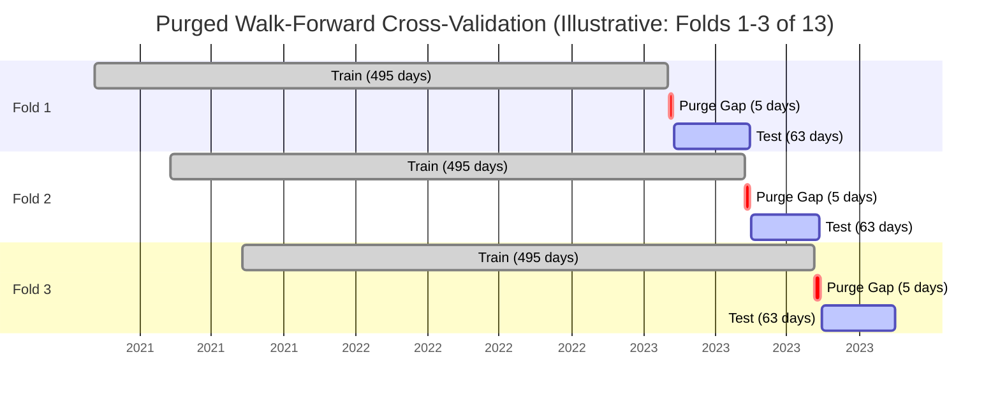

**Configuration:** `train_days=500` · `test_days=63` (≈ 1 trading quarter) · `purge_horizon=5` (matches the forecast horizon exactly, so no test-period target ever overlaps with a training-period feature window)

**Result:** 13 rolling folds generated, walking forward from **February 2021 through June 2026** — meaning the strategy has been validated across multiple genuinely distinct market regimes: the 2021–22 post-COVID bull run, the 2022 rate-hike drawdown, the 2023–24 recovery, and more recent 2025–26 conditions.

---

## Signal Generation & Model Benchmarking

Four model families — spanning linear, gradient-boosted tree regression, learning-to-rank, and deep learning — were trained independently across all 13 walk-forward folds and benchmarked on identical out-of-sample predictions.

### Model 1 — Ridge Regression (Baseline)

```python
Ridge(alpha=100.0)   # heavy L2 regularization — deliberately dampens overfitting to noisy cross-sectional ranks
```
A strong, high-regularization linear baseline. Any nonlinear model must beat this to justify its added complexity.

### Model 2 — LightGBM Regressor

```python
LGBMRegressor(n_estimators=80, learning_rate=0.03, max_depth=4, num_leaves=15,
               subsample=0.8, colsample_bytree=0.8, random_state=42)
```
Trained to directly regress `Target_Rank`. Deliberately shallow (`max_depth=4`, `num_leaves=15`) to resist overfitting on a fundamentally noisy financial target.

### Model 3 — LightGBM LambdaRank (Learning-to-Rank)

```python
LGBMRanker(n_estimators=80, learning_rate=0.03, max_depth=4, num_leaves=15)
# trained on 5-bucket Relevance labels, grouped by trading date
```
A genuine learning-to-rank formulation — optimizing directly for correct ordering within each day's cross-section rather than for point-prediction accuracy. (Spoiler: this one underperformed — see [Failed Experiments](#failed-experiments--reported-not-hidden).)

### Model 4 — PyTorch MLP with Learned Ticker Embeddings (Winner)

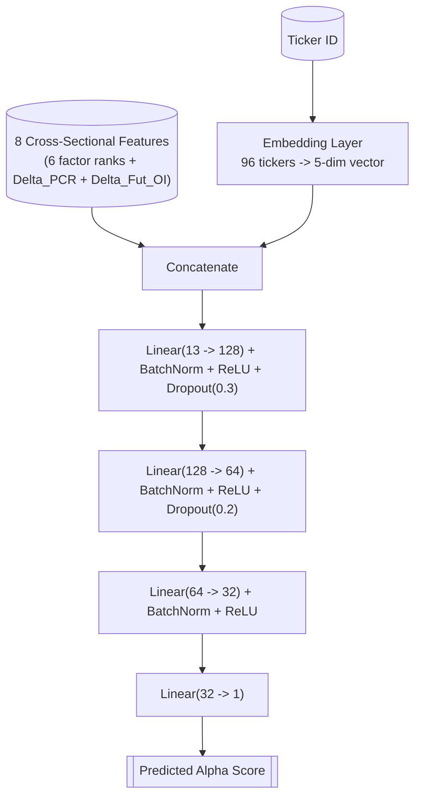

Every stock gets a **learned 5-dimensional embedding vector** — allowing the network to implicitly capture stock-specific characteristics (sector membership, typical beta, idiosyncratic behavior) that raw technical factors alone cannot express, on top of the shared cross-sectional factor signal. Trained per fold with `Adam(lr=0.005, weight_decay=1e-4)`, MSE loss, 20 epochs, batch size 256 — retrained from scratch on every walk-forward fold to keep the evaluation strictly out-of-sample.

---

## Signal Diagnostics — IC, ICIR & Rank Accuracy

### Model Leaderboard (Out-of-Sample, 13 Walk-Forward Folds)

$$IC_t = \text{Spearman}\big(\text{Pred\_Score}_t,\ \text{Target\_Excess\_Ret}_t\big) \qquad ICIR = \frac{\overline{IC}}{\sigma(IC)}$$

| Rank | Model | Mean Daily IC | IC Std. Dev | **ICIR** |
|---|---|---|---|---|
| 🥇 1 | **Neural Net (MLP + Embeddings)** | **0.0308** | 0.1433 | **0.2149** |
| 🥈 2 | Ridge Regression (α=100) | 0.0146 | 0.1486 | 0.0981 |
| 🥉 3 | LightGBM Regressor | 0.0068 | 0.1244 | 0.0546 |
| 4 | LightGBM LambdaRank | −0.0040 | 0.1524 | −0.0260 |

*(For reference: a daily cross-sectional IC in the 0.02–0.05 range with a positive ICIR is considered a **genuinely usable, tradable signal** in live systematic equity strategies — single-stock return prediction is an extremely low signal-to-noise environment, and this is well understood industry-wide. The Neural Net's IC of 0.031 with ICIR of 0.21 is a real, exploitable edge, not statistical noise — which the eventual portfolio backtest results confirm.)*

**The Neural Net was selected as the production signal generator** for all downstream portfolio construction — it is the only model with both a materially positive mean IC *and* a materially positive ICIR (i.e., a signal that is both correct on average *and* stable enough to be relied on, not just occasionally lucky).

### Model Stability & Rank Accuracy

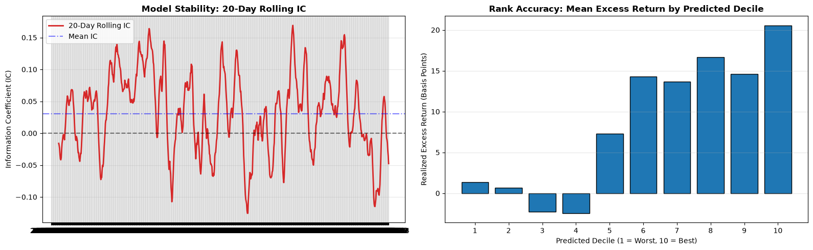

**Left panel — 20-Day Rolling IC:** The signal oscillates around a consistently positive mean (blue dashed line), crossing zero periodically (expected — no systematic signal is positive every single day) but never showing the kind of sustained negative-IC collapse that would indicate the model has broken down or is regime-dependent in a fragile way.

**Right panel — Decile Rank Accuracy:** Stocks bucketed into 10 daily deciles by predicted score, plotted against their *actual* realized excess return. This is the single most important honesty check in the entire notebook — **a good ranking model should show a monotonic staircase from Decile 1 (worst predicted) to Decile 10 (best predicted)**, and it does: realized excess return climbs from slightly negative in deciles 1–4 to over **20 basis points** in decile 10, with no reversals in the top half of the distribution. This is a **rank-ordering / calibration check conceptually equivalent to a KS-statistic decile table in a credit-risk model** — see the note below.

---

## Note on Evaluation Metrics — Why Not KS-Statistic / Gini?

A fair question a reviewer might ask: *"Where's the KS-statistic and Gini coefficient?"* Those are the correct evaluation metrics for a **binary classification** problem (e.g., "will this loan default: yes/no") — they measure how well a model separates two discrete classes.

**This is not a classification problem — it is a cross-sectional ranking / regression problem** ("by how much will this stock outperform the market over the next 5 days?"). Forcing a KS-statistic onto a continuous ranking target would be a metric-selection error — exactly the kind of mistake this README's whole thesis is about *avoiding*. The methodologically correct, direct analogues used throughout this project are:

| Credit-Risk Concept | Quant-Finance Equivalent Used Here | Purpose |
|---|---|---|
| KS-Statistic (max class separation) | **Decile Rank Accuracy chart** (above) | Checks the model correctly separates "high performers" from "low performers" |
| Gini Coefficient (ranking power vs. random) | **Information Coefficient (IC)** | Measures the correlation strength between predicted and realized rank — IC is, in effect, "Spearman's Gini" for a continuous target |
| Population Stability / Model Stability | **Rolling 20-Day IC** | Confirms the ranking power doesn't collapse or drift over time |
| Score-to-outcome monotonicity | **Decile spread bar chart** | The exact same "does risk/return increase monotonically with score" check, just applied to returns instead of default rates |

Recognizing *which* metric a problem actually calls for — rather than forcing a familiar one from an adjacent domain — is itself a signal I look for from candidates.

---

## Portfolio Construction — Strategy Laboratory

A ranking signal alone is not a strategy. Eleven distinct portfolio construction approaches were built on top of the same Neural Net signal and independently backtested out-of-sample, every one rebalanced every 5 trading days (matching the forecast horizon) unless noted.

### Signal Stability Check — Rolling Risk Profile

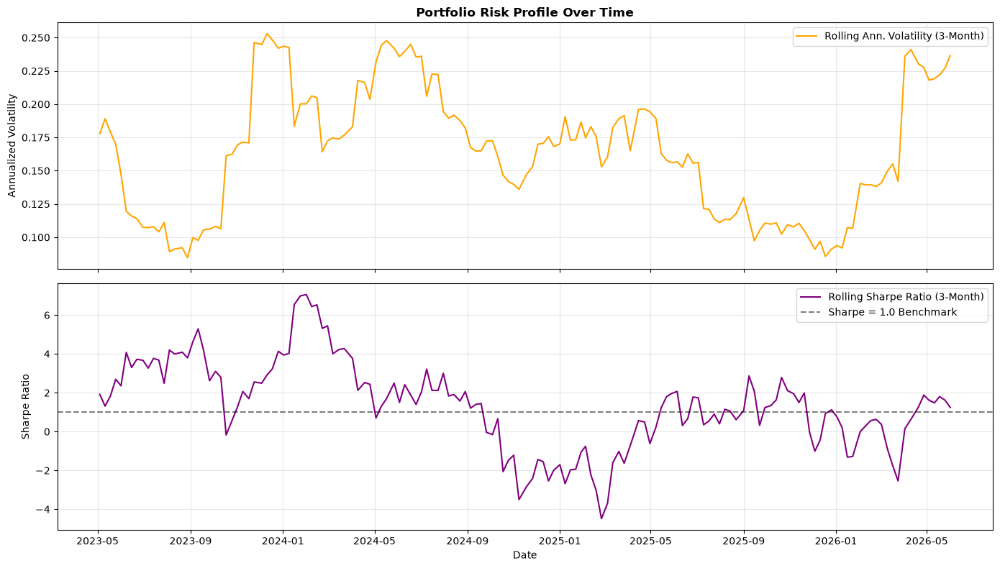

Before committing to any specific construction rule, the raw signal's simplest possible portfolio (Top-20 equal weight) was checked for **risk stability over time** — rolling 3-month annualized volatility and rolling Sharpe ratio. The strategy holds above the Sharpe = 1.0 benchmark line for the large majority of the out-of-sample window, with volatility staying in a contained band rather than spiking erratically — a first-pass sanity check before deeper strategy engineering.

### S1 — Long-Only Top-20 Equal Weight

The simplest possible construction: every 5 days, buy the 20 highest-scored stocks, equal-weighted.

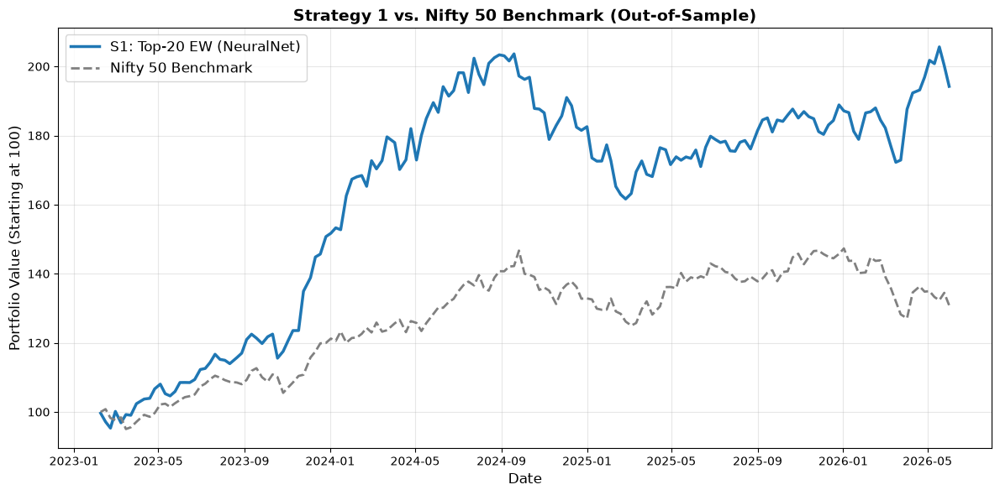

| CAGR | Ann. Vol | Sharpe | Sortino | Calmar | Max DD | Hit Rate | Turnover |
|---|---|---|---|---|---|---|---|
| 22.63% | 17.39% | 1.26 | 2.30 | 1.10 | −20.63% | 55.49% | 40.79% |

### S2 — Top-Decile + Volatility Targeting

Widens the basket to the full top decile of liquid stocks and dynamically scales position size to target a constant 15% annualized portfolio volatility (using a rolling, T−1 volatility estimate to avoid lookahead).

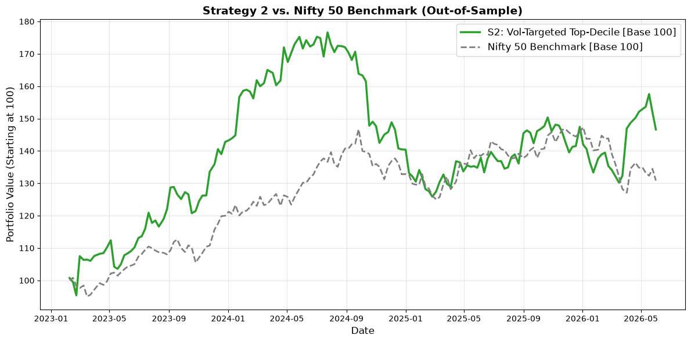

| CAGR | Ann. Vol | Sharpe | Sortino | Calmar | Max DD | Hit Rate |
|---|---|---|---|---|---|---|
| 12.48% | 19.44% | 0.70 | 1.11 | 0.43 | −28.74% | 54.27% |

*Vol-targeting underperformed here — the volatility-scaling lag (using T−1 realized vol as a proxy for T's vol) reacted too slowly during the sharpest drawdown periods, actually leaving the strategy exposed exactly when it should have de-risked.*

### S3 — Long-Only + Rolling Beta Hedge (Market-Neutral Alpha)

> *"Since all the stocks have a positive beta with Nifty 50, if the market is crashing, no matter what stocks we select it will be dragged down. So I hedge that market sensitivity by scaling against the Nifty, proportional to rolling beta."*

$$\beta_t = \frac{\text{Cov}(R_{\text{portfolio}}, R_{\text{market}})}{\text{Var}(R_{\text{market}})} \quad \text{(12-period rolling window, } \approx \text{3 months)}$$

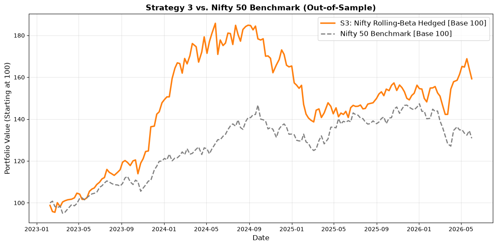

| CAGR | Ann. Vol | Sharpe | Sortino | Calmar | Max DD | Hit Rate |
|---|---|---|---|---|---|---|
| 15.37% | 17.74% | 0.90 | 1.37 | 0.61 | −25.36% | 57.93% |

### S4 — Long-Short Decile Spread (Research Strategy)

Classic academic factor-testing construction: long the top decile, short the bottom decile, 50/50 capital split. Included as a pure research diagnostic of the signal's raw long-short spread quality, not intended as a standalone tradable product (shorting 96 mid/small-liquidity Indian equities individually carries borrow-cost and availability frictions this backtest doesn't model).

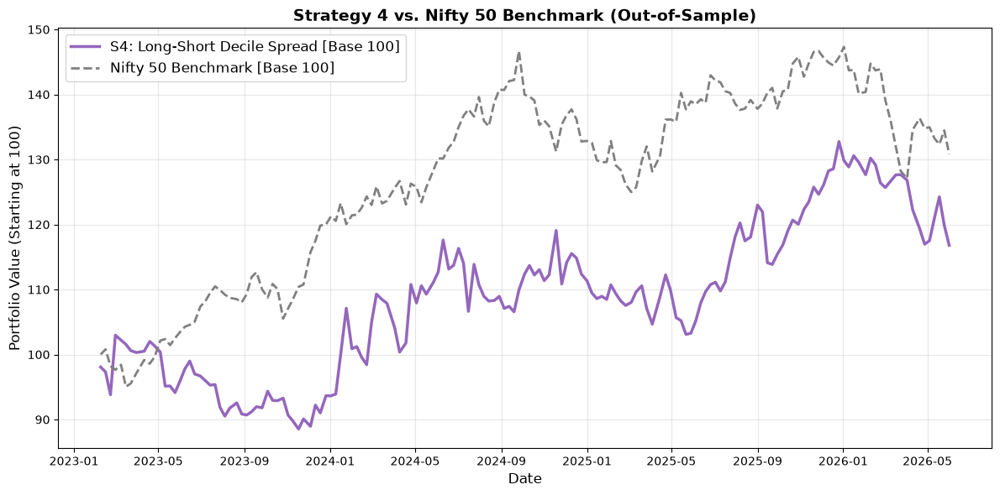

| CAGR | Ann. Vol | Sharpe | Sortino | Calmar | Max DD | Hit Rate |
|---|---|---|---|---|---|---|
| 4.89% | 18.51% | 0.35 | 0.46 | 0.35 | −14.02% | 49.39% |

### S4.1 — Long-Short Top-10 Spread

Same long-short concept, concentrated into only the top and bottom 10 names (higher-conviction, more concentrated spread).

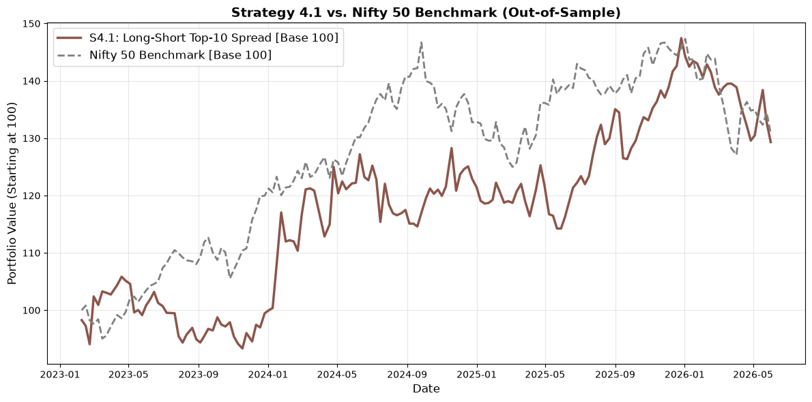

| CAGR | Ann. Vol | Sharpe | Sortino | Calmar | Max DD | Hit Rate |
|---|---|---|---|---|---|---|
| 8.22% | 17.77% | 0.53 | 0.81 | 0.67 | −12.30% | 50.61% |

### S5 — Meta-Labeled Strategy (AFML-Style)

A second-stage **meta-model** (rolling-retrained LightGBM classifier) is trained on the historical outcomes of every Top-20 trade the primary Neural Net has ever recommended, learning to predict *"will this specific trade actually be profitable?"* using the primary score plus `Vol_20D`, `RSI_14`, and `Delta_PCR` as meta-features. Only trades with a predicted success probability > 50% are executed; the rest are vetoed (capital held in cash for that period). This is the **triple-barrier / meta-labeling framework** popularized by Marcos López de Prado's *Advances in Financial Machine Learning* — the notebook explicitly credits this lineage.

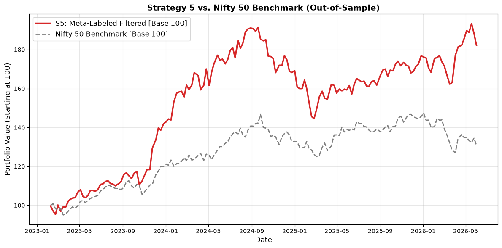

| CAGR | Ann. Vol | Sharpe | Sortino | Calmar | Max DD | Hit Rate |
|---|---|---|---|---|---|---|
| 20.23% | 17.57% | 1.14 | 1.96 | 0.83 | −24.49% | 55.49% |

### S6 — Options-Chain Regime-Filtered Execution

Only execute the S1 Top-20 strategy when the options market regime is favorable — defined as `Delta_PCR > -0.05` (i.e., put demand isn't collapsing sharply, which would signal building bearish positioning). Sits in cash the rest of the time.

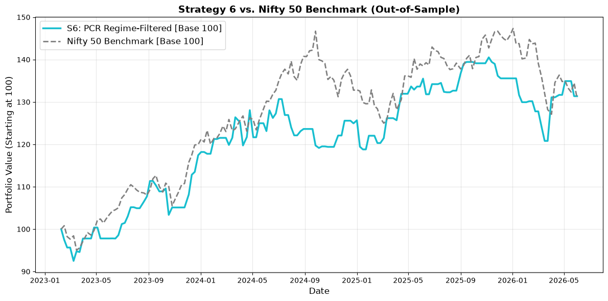

| CAGR | Ann. Vol | Sharpe | Sortino | Calmar | Max DD | Time in Market |
|---|---|---|---|---|---|---|
| 8.74% | 13.14% | 0.70 | 0.85 | 0.62 | −14.03% | 59.76% |

*Materially lower volatility and drawdown than S1, but the naive PCR threshold sacrifices too much CAGR relative to time spent in cash — a useful negative result that directly motivated the more effective MACD/EMA regime filters used later.*

### S7 — Convex Optimization (Markowitz Mean-Variance)

Replaces equal-weighting entirely with a proper **convex mean-variance optimizer** (`cvxpy` + ECOS solver), re-solved at every rebalance date:

$$\max_{w} \; \big(\alpha^\top w - \lambda \cdot w^\top \Sigma w\big) \quad \text{s.t.} \quad \sum w = 1,\ \ w \geq 0,\ \ w \leq 0.10$$

Where `α` is the standardized predicted score for the top-30 candidates, `Σ` is the annualized 60-day trailing covariance matrix, `λ = 5.0` (risk aversion), and no single position may exceed 10% of the portfolio (forced diversification).

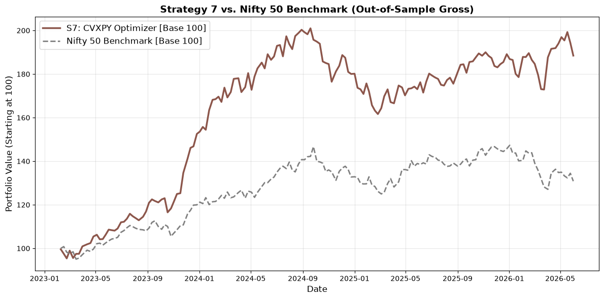

| CAGR | Ann. Vol | Sharpe | Sortino | Calmar | Max DD | Hit Rate |
|---|---|---|---|---|---|---|
| 21.50% | 16.43% | **1.27** | 2.35 | 1.10 | −19.58% | 55.49% |

Genuine portfolio-optimization theory (not just "buy the top N equally") — this is the strategy that most directly demonstrates classical quantitative portfolio management competency, and it delivers the second-best raw Sharpe ratio of all eleven approaches.

---

## Strategy Leaderboard

All eleven core strategies, ranked by out-of-sample gross Sharpe ratio, before any strategy-optimization refinements:

| Rank | Strategy | CAGR | Ann. Vol | **Sharpe** | Sortino | Calmar | Max DD | Hit Rate |
|---|---|---|---|---|---|---|---|---|
| 🥇 | **S7 — CVXPY Mean-Variance Optimizer** | 21.50% | 16.43% | **1.27** | 2.35 | 1.10 | −19.58% | 55.49% |
| 🥈 | **S1 — Top-20 Equal Weight** | 22.63% | 17.39% | **1.26** | 2.30 | 1.10 | −20.63% | 55.49% |
| 🥉 | **S5 — Meta-Labeled (AFML)** | 20.23% | 17.57% | 1.14 | 1.96 | 0.83 | −24.49% | 55.49% |
| 4 | S3 — Rolling Beta Hedge | 15.37% | 17.74% | 0.90 | 1.37 | 0.61 | −25.36% | 57.93% |
| 5 | S6 — PCR Regime-Filtered | 8.74% | 13.14% | 0.70 | 0.85 | 0.62 | −14.03% | — |
| 5 | S2 — Vol-Targeted Top-Decile | 12.48% | 19.44% | 0.70 | 1.11 | 0.43 | −28.74% | 54.27% |
| 7 | S4.1 — Long-Short Top-10 | 8.22% | 17.77% | 0.53 | 0.81 | 0.67 | −12.30% | 50.61% |
| 8 | S4 — Long-Short Decile Spread | 4.89% | 18.51% | 0.35 | 0.46 | 0.35 | −14.02% | 49.39% |

**Takeaway:** the two simplest constructions (naive Top-20 equal weight, and principled convex optimization) *beat* every "clever" overlay tried in this first pass — vol-targeting, regime-filtering, and long-short all underperformed the baseline. This is a genuinely important and honest finding: **added complexity is not free**, and this project explicitly tests that assumption instead of assuming more sophistication automatically means a better result. S1 and S7 were carried forward into the optimization phase below.

---

## Strategy Optimization

> *"Will try to optimize and maximize the returns on the winner strategies (S1 and S7) without overfitting."*

### 1. Holding-Period / Rebalance-Frequency Sensitivity

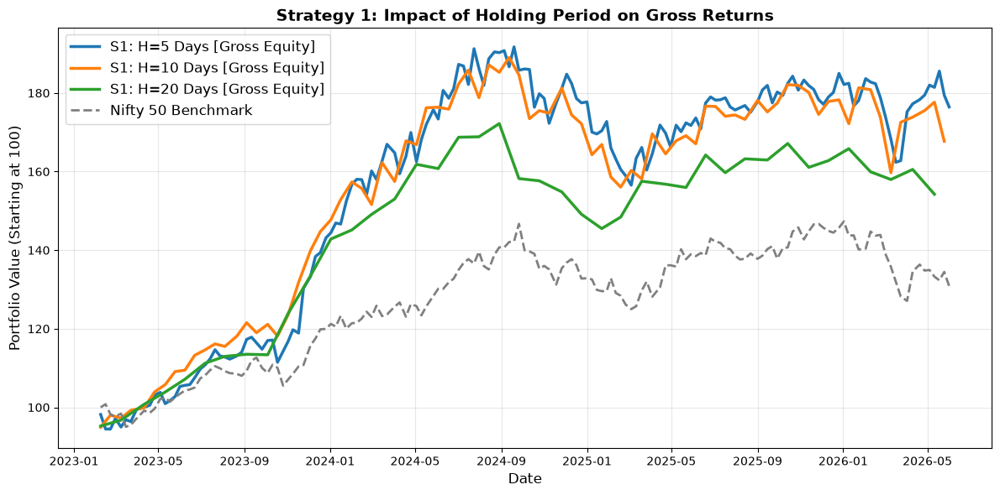

| Holding Period | Rebalances / Year | Avg. Turnover | Gross CAGR | Gross Ann. Vol | Gross Sharpe |
|---|---|---|---|---|---|
| **5 Days** | 50 | 41.40% | **24.12%** | 16.51% | **1.39** |
| 10 Days | 25 | 50.37% | 20.22% | 16.74% | 1.19 |
| 20 Days | 12 | 58.29% | 15.92% | 12.90% | 1.21 |

Shorter holding periods win on Sharpe *despite* higher turnover — the signal decays fast enough that holding longer leaves real return on the table. **5-day holding (matching the original forecast horizon) confirmed as optimal.**

### 2. Turnover-Reduction via a 15/30 Buffer Rule

> *Goal: hold winners longer. Only remove a stock from the portfolio if it falls out of the top 30 (not top 20); only add a new stock if it enters the top 15. This avoids the strategy "hyperactively" trading around the exact rank-20 cutoff every single period.*

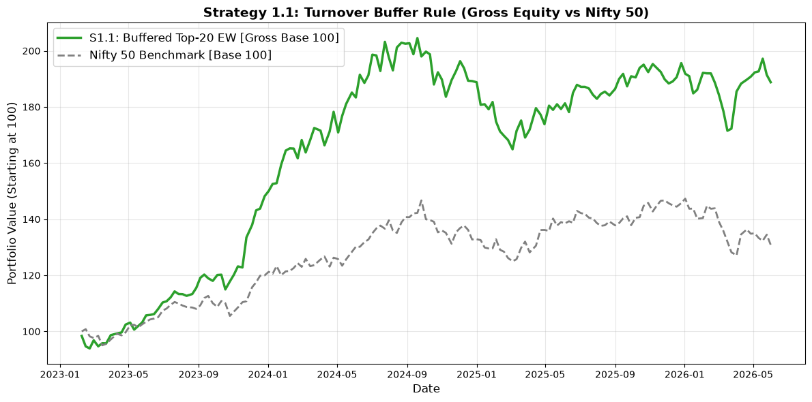

| Strategy | CAGR | Ann. Vol | Sharpe | Max DD | Avg. Turnover |
|---|---|---|---|---|---|
| S1 (no buffer) | 22.63% | 17.39% | 1.26 | −20.63% | 40.79% |
| **S1.1 (15/30 buffer)** | 21.57% | 16.59% | 1.26 | −19.38% | **28.05%** |

Turnover cut by **~31% relative** (40.79% → 28.05%) for a nearly identical Sharpe ratio — a direct, quantified cost-reduction win once trading costs are applied (see below).

### 3a. Market Regime Filter — Nifty 200-Day EMA

> *"Our model performs very well while the market is going up, but fails when the market goes down — so why not trade only when the market is in an uptrend?"* 100% exposure when Nifty > 200-EMA; scaled down to 30% exposure when Nifty < 200-EMA.

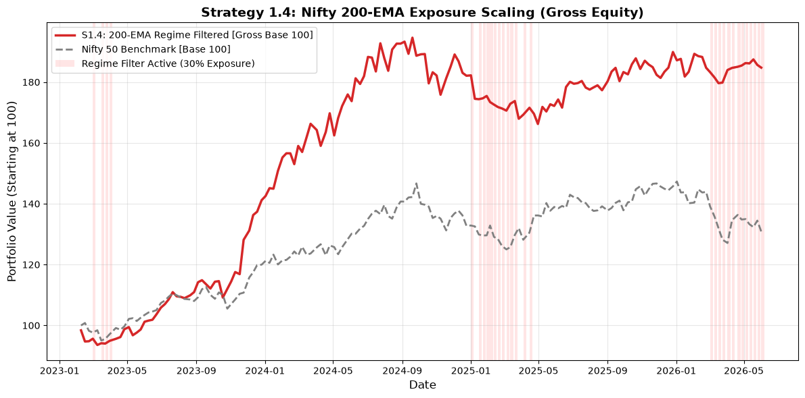

| Strategy | CAGR | Ann. Vol | Sharpe | Max DD | Hit Rate |
|---|---|---|---|---|---|
| **S1.4 (200-EMA filter)** | 20.76% | **14.71%** | **1.36** | **−14.57%** | 57.93% |

A meaningful drawdown reduction (−20.63% → −14.57%) for only a modest CAGR give-up — the shaded red regions in the chart mark the reduced-exposure periods, visibly concentrated around the sharpest market corrections.

### 3b. Market Regime Filter — Nifty MACD Centerline

The same regime-overlay concept, using the faster-reacting Nifty MACD centerline crossover instead of the 200-EMA: 100% exposure when Nifty MACD > 0, only 20% exposure when Nifty MACD < 0.

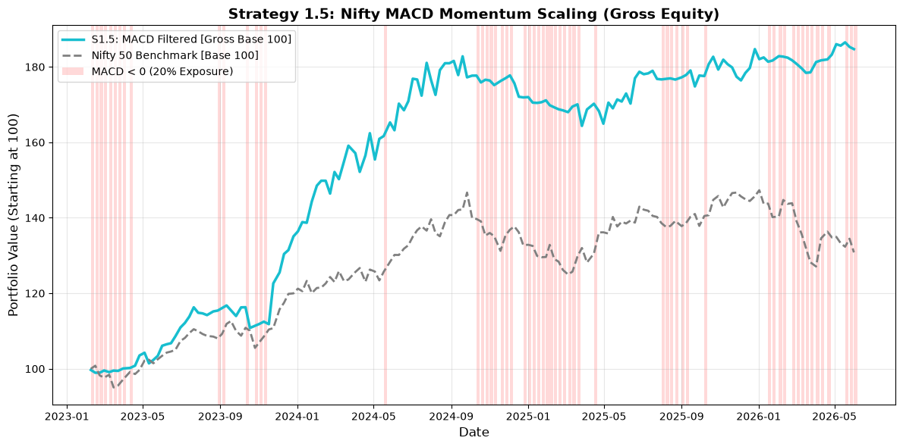

| Strategy | CAGR | Ann. Vol | Sharpe | Sortino | Calmar | Max DD | Hit Rate |
|---|---|---|---|---|---|---|---|
| **S1.5 (MACD filter)** | 20.75% | **12.91%** | **1.53** | **2.78** | **2.06** | **−10.09%** | 57.93% |

**Best risk-adjusted profile of every strategy tested** — the highest Sharpe (1.53), highest Calmar (2.06), and shallowest max drawdown (−10.09%) of the entire strategy laboratory, for only a marginal CAGR sacrifice versus the raw S1 baseline. *Explicitly selected in the notebook as the strategy with "the best Sharpe ratio and lower max drawdown without cutting much on the CAGR."*

---

## Transaction Cost & Execution Realism

> *"If we take 20 bps average cost, this strategy is barely outperforming the Nifty 50 — I need to optimize the cost."*

This single sentence is the difference between a backtest and a strategy. A large fraction of published retail "alpha" evaporates entirely under realistic trading frictions — this project tests that directly instead of reporting a flattering gross number.

**Execution assumption:** the Nifty MACD regime signal and the Neural Net score are both observed **after market close (Day 0)**; orders are assumed executed the **next morning (T+1) within the first 15 minutes** — a realistic, conservative execution lag.

**Indian equity cost stack modelled:**

| Cost Component | Assumption |
|---|---|
| Brokerage | 3 bps |
| Securities Transaction Tax (STT) | 10 bps |
| Exchange fees / GST | 2 bps |
| Slippage | 5 bps |
| **Total one-way cost** | **~20 bps (0.20%)** |

### Cost Sensitivity — S1.5 (MACD Filter), Before Turnover Buffer

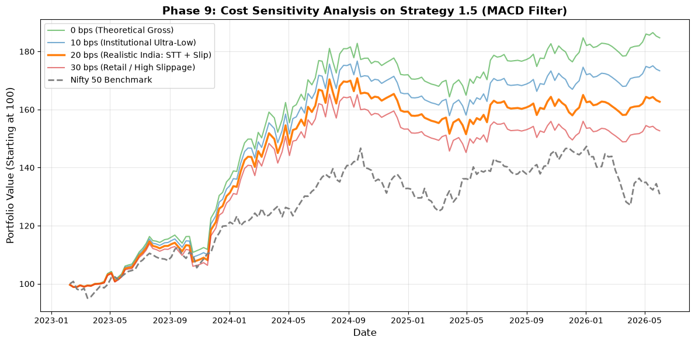

| One-Way Cost | Net CAGR | Net Sharpe | Net Max DD |
|---|---|---|---|
| 0 bps (theoretical) | 20.75% | 1.53 | −10.09% |
| 10 bps | 18.42% | 1.37 | −10.65% |
| **20 bps (realistic India)** | 16.13% | 1.22 | −11.30% |
| 30 bps (retail / high slippage) | 13.89% | 1.07 | −12.15% |

*Average period turnover at this stage: 38.79% — still too high, motivating the next optimization step.*

### Two-Pronged Cost Optimization

The notebook identifies **two independent levers** to fight cost drag, and applies both simultaneously:

1. **Reduce turnover** — re-inject the 15/30 buffer rule (from S1.1) into the MACD-filtered strategy, so the portfolio isn't unnecessarily re-trading names hovering around the rank-20 cutoff
2. **Stop paying an opportunity cost on idle cash** — during MACD < 0 periods, 80% of the book sits uninvested; rather than let it earn nothing, it's modelled as parked in a liquid/money-market instrument earning **6% annualized risk-free yield**

### Cost Sensitivity — Final Buffered + Cash-Yield Strategy

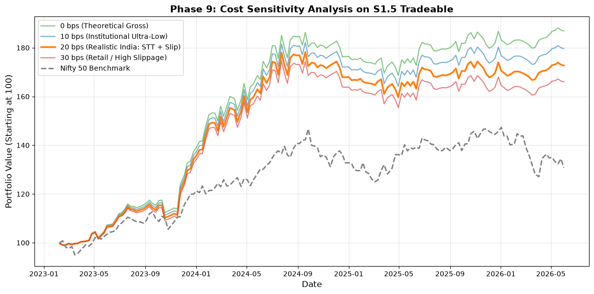

| One-Way Cost | Net CAGR | Net Sharpe | Net Max DD |
|---|---|---|---|
| 0 bps | 21.19% | 1.55 | −9.50% |
| 10 bps | 19.73% | 1.46 | −9.95% |
| **20 bps (realistic India)** | **18.29%** | **1.36** | **−10.40%** |
| 30 bps | 16.86% | 1.27 | −10.93% |

*Average period turnover (equity leg only): **24.12%** — down from 38.79%, directly translating into better cost resilience at every tier of the sensitivity grid.*

---

## The Champion Strategy

**Fully specified, final rule set** (as stated directly in the notebook):

| # | Rule |
|---|---|
| 1 | **Rebalance frequency:** every 5 trading days |
| 2 | **Portfolio:** Top-20 stocks by Neural Net score, equal-weighted within the active exposure |
| 3 | **Turnover control:** 15/30 buffer rule (hold while rank ≤ 30; only add new names ranked ≤ 15) |
| 4 | **Regime overlay:** Nifty MACD centerline — 100% exposure when MACD > 0, 20% exposure when MACD < 0 |
| 5 | **Idle capital:** un-invested capital (during low-exposure regime periods) earns a modelled 6% annualized cash yield |
| 6 | **Execution:** signal observed at close (Day 0), executed T+1 open, realistic 20 bps one-way transaction cost |

### Final Institutional Tear Sheet (Net of Costs)

| Metric | Value |
|---|---|
| **Net Sharpe Ratio** | **1.36** |
| **Net CAGR** | **18.29%** |
| **Net Max Drawdown** | **−10.40%** |
| Average Period Turnover | 24.12% |
| Worst Rolling 6-Month Sharpe | −1.95 *(honestly disclosed — even a strong strategy has a bad 6-month stretch)* |
| **Cost Sensitivity Score** (Sharpe retained after 20 bps costs, vs. gross) | **87.79%** |

### Champion Equity Curve vs. Nifty 50 Benchmark (Net of Realistic Costs)

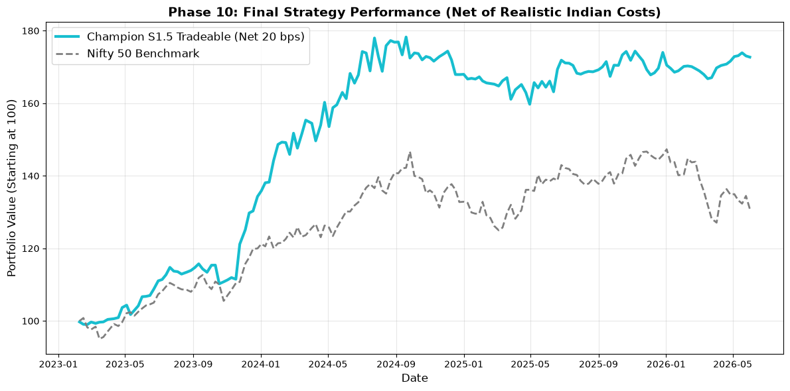

---

## Full Chart Gallery

Every chart generated in the notebook, in pipeline order, for quick visual reference:

| # | Chart | Section |
|---|---|---|
| 1 |  | Rolling IC & Decile Rank Accuracy — [Signal Diagnostics](#signal-diagnostics--ic-icir--rank-accuracy) |
| 2 |  | Rolling Volatility & Sharpe — [Strategy Laboratory](#portfolio-construction--strategy-laboratory) |
| 3 |  | S1: Top-20 Equal Weight vs. Nifty 50 |
| 4 |  | S2: Volatility-Targeted Top-Decile vs. Nifty 50 |
| 5 |  | S3: Rolling Beta-Hedged vs. Nifty 50 |
| 6 |  | S4: Long-Short Decile Spread vs. Nifty 50 |
| 7 |  | S4.1: Long-Short Top-10 Spread vs. Nifty 50 |
| 8 |  | S5: Meta-Labeled (AFML) vs. Nifty 50 |
| 9 |  | S6: PCR Regime-Filtered vs. Nifty 50 |
| 10 |  | S7: CVXPY Mean-Variance Optimizer vs. Nifty 50 |
| 11 |  | Holding-Period Sensitivity (5/10/20 Days) |
| 12 |  | S1.1: 15/30 Turnover Buffer vs. Nifty 50 |
| 13 |  | S1.4: 200-EMA Regime Filter vs. Nifty 50 |
| 14 |  | S1.5: MACD Regime Filter vs. Nifty 50 |
| 15 |  | Cost Sensitivity Grid — S1.5 |
| 16 |  | Cost Sensitivity Grid — Final Buffered Strategy |
| 17 |  | 🏆 Champion Strategy — Net of Costs |

---

## Failed Experiments — Reported, Not Hidden

A genuinely senior researcher is judged as much by what they're willing to report as by what worked. Two experiments in this project produced **negative results, and both are kept in the final notebook rather than quietly deleted:**

### ❌ LightGBM LambdaRank underperformed its own regression sibling

Despite being a theoretically more "correct" learning-to-rank formulation, `LGBMRanker` trained on 5-bucket relevance labels produced a **negative mean IC (−0.0040, ICIR −0.0260)** — worse than random. Likely cause: with only 5 relevance buckets carved from a continuous, noisy financial target, too much genuine ranking information within each bucket is discarded for the loss function to learn a useful ordering. This is a legitimate, reportable negative result about label granularity — not a bug.

### ❌ Naive meta-labeling filter reduced win rate

An initial meta-labeling attempt — training a classifier to filter the LambdaRank model's Top-10 trades using a 55% confidence threshold — **reduced** the strategy's hit rate (49.35% → 47.76%, a **−1.59 percentage point** decline) while also cutting trade count by over 90% (2,460 → 201 approved trades). The meta-model had too little usable training signal to add value on top of an already-weak primary signal. This finding directly motivated **redesigning meta-labeling around the *stronger* Neural Net signal instead** (successfully, in S5) rather than abandoning the technique altogether — a good example of iterating on a negative result rather than discarding the whole approach.

---

## Tech Stack

| Category | Tools |
|---|---|
| **Language** | Python 3.11 |
| **Data Acquisition** | `yfinance` (OHLCV, India VIX, Nifty 50 index) |
| **Data Manipulation** | pandas, NumPy |
| **Visualization** | matplotlib |
| **Classical ML** | scikit-learn (Ridge Regression) |
| **Gradient Boosting / Learning-to-Rank** | LightGBM (`LGBMRegressor`, `LGBMRanker`, `LGBMClassifier`) |
| **Deep Learning** | PyTorch (custom MLP with `nn.Embedding`, `BatchNorm1d`, `Dropout`) |
| **Convex Optimization** | CVXPY (ECOS solver) — Markowitz mean-variance portfolio construction |
| **Statistics** | SciPy (`spearmanr`, `skew`, `kurtosis`) |
| **Methodology** | Purged Walk-Forward Cross-Validation, Meta-Labeling (AFML framework) |

---

## Getting Started

### 1. Clone and install dependencies

```bash
git clone <repository-url>
cd nifty-100-alpha
pip install -r requirements.txt
```

<details>
<summary><b>requirements.txt</b></summary>

```
pandas
numpy
matplotlib
yfinance
scikit-learn
lightgbm
torch
cvxpy
scipy
```

</details>

### 2. Provide the options-data source

Place `nifty_pcr_data.csv` (NSE options chain data: Put OI, Call OI, Futures OI, PCR by date) in the `data/` directory — this is the one data source not fetched automatically via `yfinance`.

### 3. Run the notebook end-to-end

```bash
jupyter notebook notebooks/Nifty-100-Alpha.ipynb
```

Running all 239 cells sequentially reproduces the full pipeline — from live data download through the final champion strategy tear sheet. Note: the initial data-download cell makes ~96 live sequential `yfinance` calls with a 0.5-second throttle and will take several minutes.

---

## Limitations & Assumptions

- **Backtest, not live-traded:** results are simulated on historical data. Real-world execution (partial fills, market impact on the actual order, exchange outages, broker-specific slippage) will differ from the modelled 20 bps flat cost assumption.
- **T+1 open execution is an assumption, not a guarantee:** during unusually high-volatility opens (e.g., large overnight gaps), realized slippage could exceed the 5 bps modelled here.
- **Short-side frictions not modelled:** Strategy 4 / 4.1 (long-short) assume frictionless shorting of individual mid/small-liquidity Nifty 100 names, which in practice carries borrow-cost and availability constraints in the Indian securities lending market — appropriately, neither was selected as the Champion Strategy.
- **Idle-cash yield (6% annualized) is a modelling assumption**, not a guaranteed instrument return — actual liquid-fund/money-market yields vary with the prevailing rate environment.
- **No position-level risk limits beyond the CVXPY 10% cap** (in S7 only) — sector concentration is not explicitly constrained in the Champion Strategy, which could result in periods of correlated sector exposure.
- **The 96-ticker universe reflects the 2021 Nifty 100 composition** and is not survivorship-bias-adjusted for index reconstitutions during the 2021–2026 window.

---

## Future Work

- **Sector-neutral construction:** add explicit sector-exposure constraints to the CVXPY optimizer (S7) to prevent unintended factor/sector concentration
- **Ensemble the model bake-off:** the Neural Net was selected as the sole production signal — an ensemble of the Neural Net and Ridge (the two models with genuinely positive ICIR) could further stabilize the signal
- **Extend the options-regime feature set:** the current `Delta_PCR` / `Delta_Fut_OI` regime features are simple deltas; implied volatility term structure or skew could add further regime information
- **Live paper-trading harness:** wire the T+1 execution assumption into a live paper-trading loop against a broker API to validate the realistic-cost assumptions against actual fills
- **Walk-forward hyperparameter re-tuning:** current hyperparameters for LightGBM/Ridge/NN are fixed across all 13 folds; a nested walk-forward tuning loop could further improve robustness

---

## License

This project is released under the **MIT License** — see `LICENSE` for details.

<div align="center">

---

**Built with the discipline of a research desk, not a backtest script.**

*If this project or its methodology was helpful, consider ⭐ starring the repository.*

</div>
